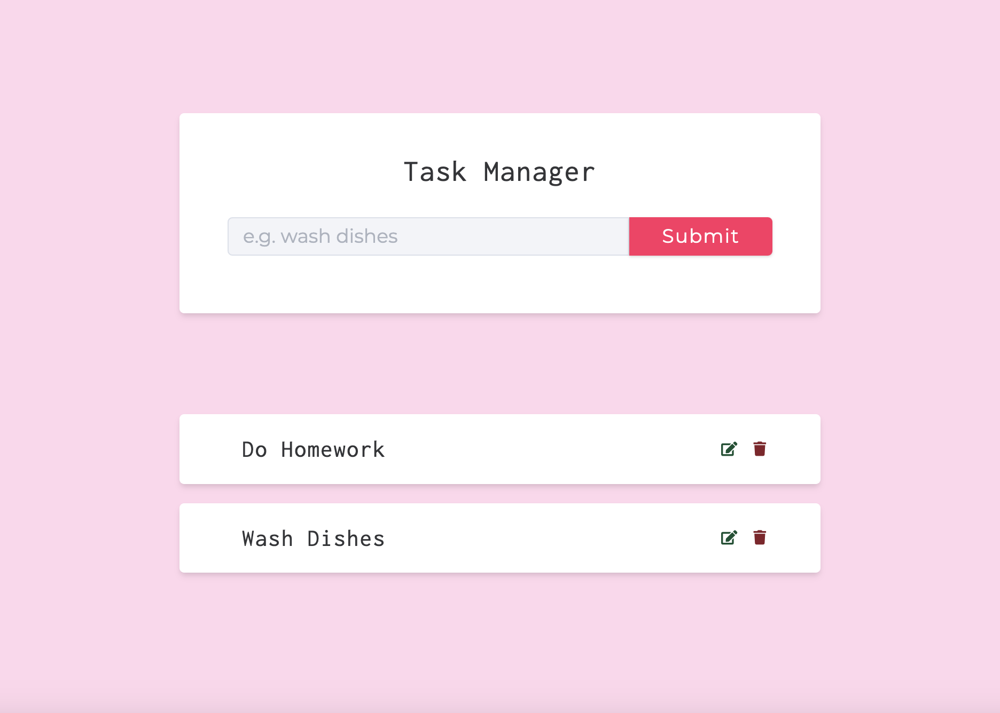

# Task Manager API

### Live Demo: [Task Manager](https://task-manager-api-jh9c.onrender.com/)



#### Routes Structure

<!--- If we have only one group/collection, then no need for the "ungrouped" heading -->

- [Task Manager API](#task-manager-api)
  - [Live Demo: Task Manager](#live-demo-task-manager)
    - [Routes Structure](#routes-structure)
  - [Endpoints](#endpoints)
    - [1. DeleteTask](#1-deletetask)
    - [2. Update Task](#2-update-task)
    - [3. Create New Task](#3-create-new-task)
    - [4. Get Single Task](#4-get-single-task)
    - [5. Get All Tasks](#5-get-all-tasks)

## Endpoints

---

### 1. DeleteTask

**_Endpoint:_**

```bash
Method: DELETE
Type:
URL: https://task-manager-api-jh9c.onrender.com/api/v1/tasks/65f7db98af8606865a7b8ae
```

### 2. Update Task

**_Endpoint:_**

```bash
Method: PATCH
Type: RAW
URL: https://task-manager-api-jh9c.onrender.com/api/v1/tasks/65f7db93af8606865a7b8aec
```

**_Headers:_**

| Key          | Value            | Description |
| ------------ | ---------------- | ----------- |
| Content-Type | application/json | JSON Type   |

**_Body:_**

```js
{
    "name":"Play piano",
    "completed":true
}
```

### 3. Create New Task

**_Endpoint:_**

```bash
Method: POST
Type: RAW
URL: https://task-manager-api-jh9c.onrender.com/api/v1/tasks/
```

**_Headers:_**

| Key          | Value            | Description |
| ------------ | ---------------- | ----------- |
| Content-Type | application/json | JSON Type   |

**_Body:_**

```js
{
    "name": "Take a shower",
    "completed": true
}
```

### 4. Get Single Task

**_Endpoint:_**

```bash
Method: GET
Type:
URL: https://task-manager-api-jh9c.onrender.com/api/v1/tasks/65f7db93af8606865a7b8aec
```

### 5. Get All Tasks

Get all the tasks

**_Endpoint:_**

```bash
Method: GET
Type:
URL: https://task-manager-api-jh9c.onrender.com/api/v1/tasks
```

---

> Generated at 2024-03-18 21:13:17 by [docgen](https://github.com/thedevsaddam/docgen)
